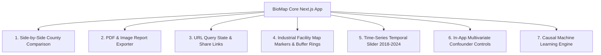
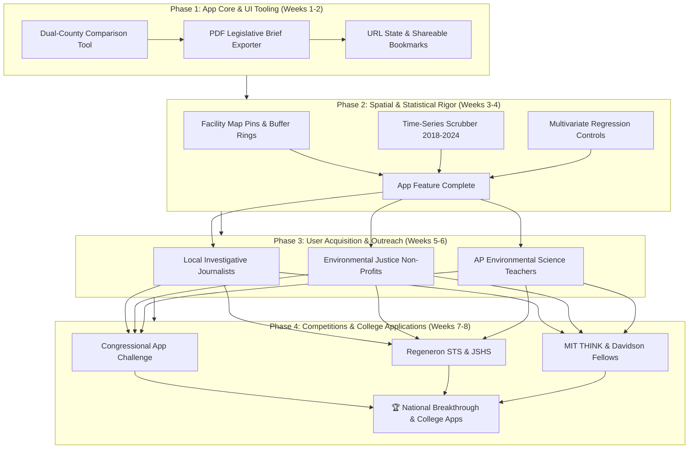

# 🛠️ BioMap: Core App Features & Technical Requirements

> **Platform Goal**: BioMap is an advanced environmental epidemiology & spatial analytics engine connecting multi-source federal databases (EPA, CDC WONDER, NASA FIRMS, US Census) with machine learning and causal inference to quantify environmental injustice and project health policy outcomes across 3,100+ U.S. counties.

---

## ❓ "Does the app just need ML, or what else does the core app need?"

**Machine Learning is only one piece of a breakthrough application.** While ML provides predictive power, a truly compelling, college-caliber web application requires **robust UI/UX tooling, data export capabilities, state persistence, and interactive spatial features**.

Below is the definitive breakdown of what the core frontend and backend app needs right now, organized by urgency:

---

## 🚀 1. Core App Technical Features Needed (Non-ML)

### 1️⃣ Dual-County Side-by-Side Comparison Tool (`/app/_components/analysis/CountyCompareModal.tsx`)
* **Current State**: Users can only inspect one county at a time in the right `SidePanel`.
* **What's Needed**:
  - A dedicated "Compare Counties" mode allowing users to select 2 or 3 counties simultaneously (e.g. *Harris County, TX vs. Cook County, IL*).
  - Side-by-side metric comparison table ($\text{PM}_{2.5}$, Toxic Releases, COPD Mortality, Physician Density, Poverty, Uninsured).
  - Risk factor Radar Chart (`Recharts`) comparing baseline vulnerabilities.
  - Relative risk delta calculation (e.g., *"County A has 42% higher toxic releases and 1.8x higher mortality than County B"*).

### 2️⃣ PDF & Executive Summary Exporter (`/app/_components/ui/ReportExporter.tsx`)
* **Current State**: No way to export or save data.
* **What's Needed**:
  - 1-click **"Export County Health Profile"** button producing a formatted 1-page PDF/PNG.
  - Generates a print-ready report containing the county map thumbnail, metric scorecard, policy simulation estimates (lives saved/economic savings), and data source citations.
  - Enables community members to hand physical reports to city council members or teachers.

### 3️⃣ URL Query Parameter Synchronization & Shareable Bookmarks
* **Current State**: Refreshing the browser or sharing a URL resets the map, clearing selected county, active metric, and search state.
* **What's Needed**:
  - Sync UI state with Next.js `useSearchParams` and `useRouter` (`/map?fips=06037&metric=pm25&view=analysis`).
  - Copy-to-clipboard "Share Link" button with toast notification so users can send exact map views to colleagues.

### 4️⃣ EPA TRI Industrial Facility Map Pins & Buffer Rings (`MapContainer.tsx`)
* **Current State**: Facilities are listed as text in `SidePanel`, but not displayed as spatial points on the map.
* **What's Needed**:
  - Toggle map layer for EPA Toxic Release Inventory (TRI) facility markers.
  - Interactive 5-mile and 10-mile radius buffer circles around facilities to visualize population exposure zones.
  - Facility hover cards showing annual chemical emissions (lbs/year) and primary toxic chemicals.

### 5️⃣ Time-Series Temporal Scrubber (2018–2024 Annual Trends)
* **Current State**: App displays a single 5-year average static snapshot.
* **What's Needed**:
  - Bottom timeline scrubber letting users slide between annual datasets (2018 $\rightarrow$ 2024).
  - Animated map playback showing $\text{PM}_{2.5}$ hotspot shifts and COVID-19 emissions drop effects.
  - Historical line charts inside `SidePanel`.

### 6️⃣ In-App Multivariate Regression & Confounder Adjustment
* **Current State**: `AnalysisView` currently runs *bivariate OLS regression* (X vs. Y).
* **What's Needed**:
  - Add in-app multivariate regression controls allowing users to hold smoking rates, poverty %, and physician density constant.
  - Display adjusted odds ratios and partial correlation coefficients directly in the browser!

---

## 🤖 2. Machine Learning Features Needed (ML Pipeline)

Alongside core app improvements, ML elevates the project from descriptive statistics to predictive epidemiology:

1. **Causal Double Machine Learning (DML / EconML)**: Estimate true causal effect of $\text{PM}_{2.5}$ reduction on mortality, removing confounders.
2. **Outlier Anomaly Spotter**: Automated regression residual detector finding counties with unexpectedly high/low mortality relative to pollution.
3. **Wildfire Smoke Anomaly Classifier**: ML model separating chronic industrial emissions from satellite-detected wildfire smoke events (NASA FIRMS).

---

## 📊 Breakthrough Product & User Growth Roadmap (Mermaid Architecture)

---

## 📅 Major Competitions Target Calendar

| # | Competition | Target Deadline | Category / Track | Key Submission Requirement | Prestige & Award |
| :--- | :--- | :--- | :--- | :--- | :--- |
| 1 | **Congressional App Challenge** | **October 31, 2026** *(Open Now)* | Civic Tech / Public Health / Government Data | 3-minute video demo + software architecture description | Displayed in U.S. Capitol, House.gov feature, D.C. Reception |
| 2 | **Regeneron Science Talent Search (STS)** | **November 11, 2026** | Environmental Science / Computational Biology | 20-page formal scientific research paper | "Junior Nobel Prize"; Up to **$250,000** top awards, top 300 scholars |
| 3 | **Junior Science & Humanities Symposium (JSHS)** | **Nov 15, 2026 – Jan 5, 2027** *(By State)* | Environmental Science / Math & Computer Science | 12-page research manuscript + oral presentation deck | Sponsored by US Army/Navy/Air Force; **$12,000+** college scholarships |
| 4 | **The Earth Prize** | **Oct 31 (Reg) / Jan 30 (Final)** | Air Quality / Environmental Sustainability | Solutions project report + community advocacy evidence | **$100,000** total global prize pool |
| 5 | **MIT THINK Scholars Program** | **January 1, 2027** | CS & Applied Social Technology | Technical proposal & working prototype demo | Mentorship by MIT professors, **$1,000 seed grant**, all-expenses trip to MIT |
| 6 | **Davidson Fellows Scholarship** | **Mid-February 2027** | Technology / Science / Public Service | Comprehensive research paper, codebase, and civic utility portfolio | **$50,000**, **$25,000**, and **$10,000** undergraduate scholarships |

---

## ✍️ How to Frame BioMap in College Applications

### Common App Activities List (150 Characters)
> **Lead Researcher & Developer, BioMap** | Built ML spatial epidemiology engine merging CDC/EPA/NASA data across 3,100+ counties. 1,000+ users, published policy briefs used by regional EJ groups.

### College Essay Hook Angle
> *"When I plotted PM2.5 concentrations against CDC respiratory mortality rates, the highest-risk counties were not random. They traced freeway corridors and industrial valleys in low-income zip codes. BioMap was born from a simple question: Can we use causal machine learning and spatial data to prove environmental injustice and give vulnerable communities the data to fight back?"*

---
*Document updated on July 25, 2026 for BioMap Core App Features & Technical Roadmap.*
