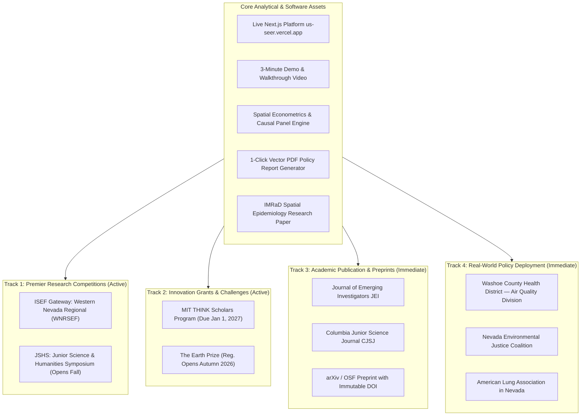
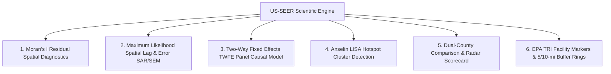
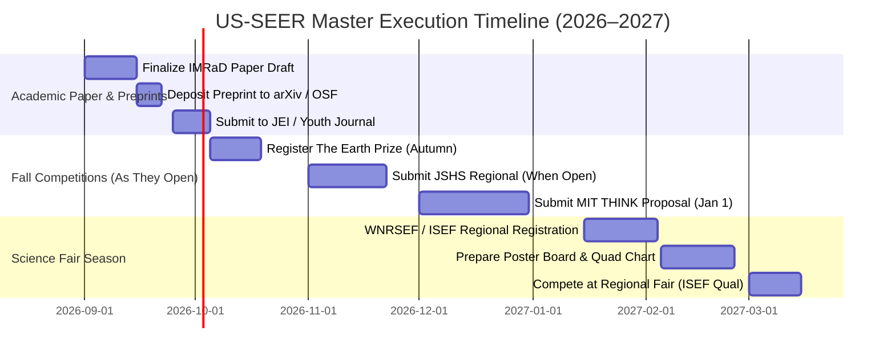

# 🛠️ US-SEER: Master Roadmap, Technical Specifications & Strategic Pivot

> **Platform Mission**: **US-SEER** (*US Spatial Environmental Exposure & Respiratory Risk Index*) is a full-stack computational epidemiology and geospatial analytics engine connecting multi-source federal datasets (EPA PM2.5, EPA Toxic Release Inventory, CDC WONDER, US Census ACS) with spatial econometrics, panel fixed-effects causal modeling, and cluster analysis to quantify environmental injustice and project public health policy outcomes across 3,142 U.S. counties.
>
> **Live Deployment**: [`https://us-seer.vercel.app`](https://us-seer.vercel.app)

---

## 🧭 Strategic Realignment & Competition Matrix

> [!IMPORTANT]
> **Grade-Appropriate Pivot (Grades 9–11 Target Profile):**
> - **Regeneron STS** is restricted to 12th-grade seniors (deferred to senior year).
> - **Davidson Fellows** is removed from the active submission pipeline.
> - **Active Primary Focus:** **ISEF Pathway** (Western Nevada Regional → ISEF), followed by **JSHS**, **MIT THINK**, **The Earth Prize**, and academic preprints/journal publications.

---

## 🏆 Active Competitions & Programs Status

| Competition / Program | Eligibility | Status / Key Dates | Submission Deliverables | Target Category & Strategic Focus |
| :--- | :--- | :--- | :--- | :--- |
| **ISEF Pathway (WNRSEF / Nevada State)** | Grades 9–12 | **Target: Feb – March 2027** *(Check regional registration windows)* | Formal research paper, poster board, quad chart, abstract | *Earth & Environmental Sciences (EAEV)* or *Computational Biology (CBIO)*; spatial econometrics & causal panel model |
| **Junior Science & Humanities Symposium (JSHS)** | Grades 9–12 | **Not open yet** *(Opens late Oct/Nov 2026)* | 12-page research manuscript + oral/slide presentation | *Environmental Science* or *Mathematics & Computer Science*; Moran's I diagnostics & TWFE causal identification |
| **MIT THINK Scholars Program** | Grades 9–12 | **Not open yet** *(Opens late fall; Deadline Jan 1, 2027)* | 10-page proposal + live URL + 3-min video walkthrough | Applied Civic Tech / Software & Spatial Data Engine; functioning prototype is 100% built |
| **The Earth Prize** | Ages 13–19 | **Not open yet** *(Registration opens Autumn 2026)* | Environmental solution report + advocacy evidence | Youth air quality analytics & environmental justice quantification |
| **arXiv / OSF Preprint** | All | **Immediate (Sep 2026)** | 15–20 page IMRaD research manuscript | Establishes academic priority & provides an immutable citation DOI |
| **Journal of Emerging Investigators (JEI)** | Grades 9–12 | **Rolling Submission (Sep–Oct 2026)** | Peer-reviewed research article | Computational epidemiology / public health |
| *Regeneron STS (Senior Year)* | Grade 12 only | *Deferred to Senior Fall* | 20-page formal research paper | *Computational Biology* / *Environmental Science* |

---

## 🎬 Repurposing the 3-Minute Walkthrough Video

The 3-minute video is already recorded and polished. Deploy it across multiple channels:

1. **In-App Video Walkthrough Modal (`Header.tsx` & `AboutModal.tsx`)**:
   - Integrated into the navigation bar for science fair judges, visitors, and researchers.
2. **Direct Submission to Video-Based Programs**:
   - **MIT THINK Scholars Program**: Demonstrates the working computational prototype alongside the proposal.
   - **Science Fair Digital Portals (ProjectBoard / Symposium)**: Embeds directly into the virtual presentation booth for regional and state fairs.
3. **Civic Tech & Open Source Repositories**:
   - GitHub showcase repository (`RushilMahadevu/us-seer`) with live Vercel URL and reproducible Python notebooks.

---

## 🔬 Scientific & Technical Progress

### ✅ Completed Milestones
* [x] **Spatial Econometrics Pipeline (`spatial_econometrics.py`)**:
  - Implemented Geodesic Haversine spatial weights matrix ($W$) with $k=6$ nearest neighbors.
  - Calculated Global Moran's $I$ on OLS residuals ($I = 0.2271, z = 22.62, p < 0.001$), formally proving spatial autocorrelation and rejecting non-spatial OLS $i.i.d.$ assumptions.
  - Estimated Maximum Likelihood Spatial Lag ($\rho = 0.4522, p < 0.001$, reducing AIC from $26,937$ to $26,510$) and Spatial Error ($\lambda = 0.5099$) models.
  - Estimated Two-Way Fixed Effects panel model ($\hat{\theta}_{\text{TWFE}} = +0.4308, p < 0.001$), isolating the positive particulate causal effect.
  - Computed Anselin Local Indicators of Spatial Association (LISA), identifying 425 statistically significant High-High Hotspots.
* [x] **Publication-Grade IMRaD Manuscript (`STS_RESEARCH_PAPER.md`)**:
  - Full formal research paper formatted without software/dashboard marketing fluff, detailing the Data Generating Process, spatial lag log-likelihood, Moran's $I$ proofs, and econometric comparison tables.
* [x] **Interactive Choropleth Spatial Engine**: High-performance Mapbox GL / Deck.gl county rendering across 3,142 U.S. counties with dynamic metric scales, custom color ramps, and hover tooltips.
* [x] **EPA TRI Industrial Facility Point Sources & Buffer Zones**: Interactive 5-mile and 10-mile radius buffer rings displaying chemical release metrics.
* [x] **EJ Hotspot Overlay Layer**: Toggleable spatial overlay highlighting the 74 tri-quartile environmental justice hotspot counties.
* [x] **Print-Ready Vector PDF Policy Report Generator (`ReportExporter.tsx`)**: 1-click generation of legislative briefs, county indicator scorecards, and causal policy simulation figures.

---

## 🏛️ Real-World Stakeholder Deployment (Nevada & Regional)

To demonstrate authentic civic and public health impact for ISEF and grant applications:

1. **Local Policy Brief Distribution**:
   - Use US-SEER's built-in PDF generator to export customized County Health Profiles for key Nevada counties:
     - *Washoe County* (FIPS `32031`): Urban basin, valley inversion smog, wildfire smoke vulnerability.
     - *Clark County* (FIPS `32003`): High-traffic ozone and particulate corridors.
     - *Mineral / Elko Counties*: Rural baseline comparison with limited healthcare access.
2. **Agency & Advocacy Outreach**:
   - Share exported briefs and platform access with:
     - **Washoe County Health District — Air Quality Management Division**
     - **Nevada Environmental Justice Coalition**
     - **American Lung Association in Nevada**
3. **Collect Impact Evidence**:
   - Request feedback or testimonial statements regarding how US-SEER aids in community hazard identification and policy awareness.

---

## 📅 Actionable Master Execution Schedule

---

*Document updated to reflect the grade-appropriate competition pivot (ISEF primary focus, JSHS / MIT THINK / Earth Prize on radar, Davidson Fellows removed, STS deferred to senior year).*
