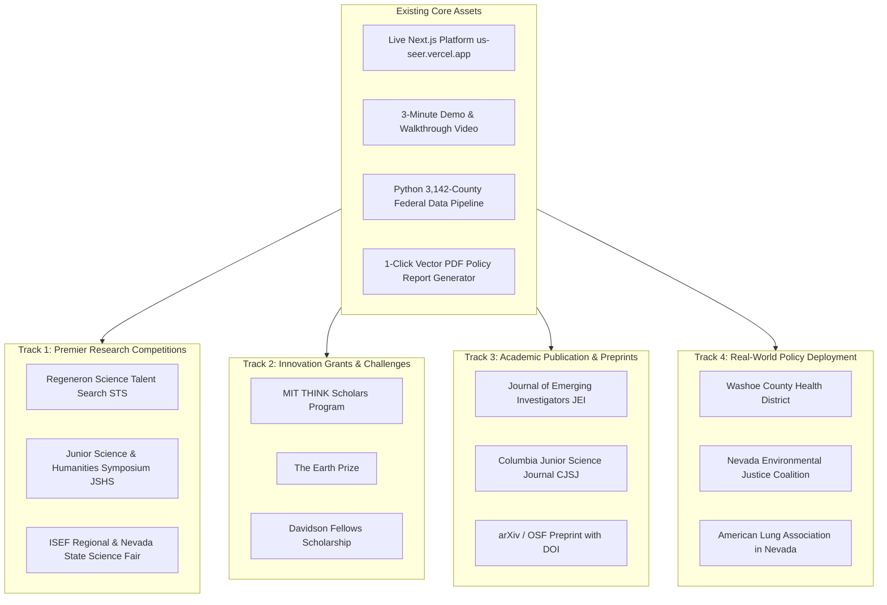
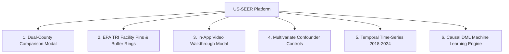
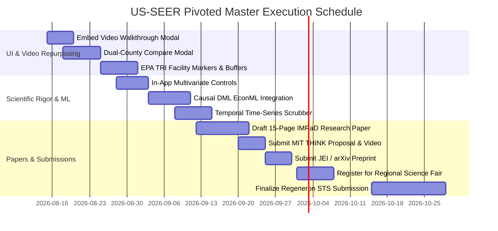

# 🛠️ US-SEER: Master Roadmap, Technical Specifications & Strategic Pivot

> **Platform Mission**: **US-SEER** (*US Spatial Environmental Exposure & Respiratory Risk Index*) is a full-stack computational epidemiology and geospatial analytics engine connecting multi-source federal datasets (EPA PM2.5, EPA Toxic Release Inventory, CDC WONDER, US Census ACS) with statistical modeling and causal inference to quantify environmental injustice and project public health policy outcomes across 3,142 U.S. counties.
>
> **Live Deployment**: [`https://us-seer.vercel.app`](https://us-seer.vercel.app)

---

## 🧭 Strategic Context & Pivot Overview

> [!IMPORTANT]
> **Strategic Realignment from CAC to National Science & Tech Competitions:**
> Nevada's 2nd Congressional District (NV-02) is not participating in the 2026 Congressional App Challenge due to Rep. Mark Amodei's retirement and district office closure to new youth programs. 
> 
> Because US-SEER was engineered as a high-rigor, multi-database epidemiological platform rather than a simple civic app, **this project is pivoted to premier national science competitions (Regeneron STS, JSHS, ISEF), technical innovation programs (MIT THINK, Earth Prize, Davidson Fellows), peer-reviewed scientific journals, and direct civic/public health deployment.**

---

## 🎬 Repurposing the 3-Minute Walkthrough Video

The 3-minute video is already recorded and polished. Rather than shelving it, deploy it immediately across multiple channels:

1. **In-App Video Walkthrough Modal (`Header.tsx` & `AboutModal.tsx`)**:
   - Add a dedicated **"Watch 3-Min Video Tour"** button in the top navigation bar.
   - Launches an embedded, accessible video player modal allowing visitors, judges, and researchers to get an instant guided tour of US-SEER's methodology, UI features, and empirical findings.
2. **Direct Submission to Video-Based Programs**:
   - **MIT THINK Scholars Program**: Uses the 3-minute video as proof of a functioning software prototype alongside the project proposal.
   - **Samsung Solve for Tomorrow & Microsoft Imagine Cup Junior**: Direct video submission demonstrating technology applied to public health and air quality equity.
   - **Science Fair Digital Portals (ProjectBoard / Symposium)**: Embeds directly into the virtual presentation booth for regional and state fairs.
3. **Civic Tech & Hackathon Platforms (Devpost / EarthHacks)**:
   - Live project showcase featuring the 3-minute demo video + live Vercel URL + open-source GitHub repository.

---

## 💻 Technical Feature Roadmap

### ✅ Completed Milestones
* [x] **Multi-Source Data Engineering Pipeline**: Automated ingestion, cleaning, FIPS matching, and suppression handling across 3,142 U.S. counties for EPA PM2.5, CDC WONDER, and Census ACS datasets.
* [x] **Interactive Choropleth Spatial Engine**: High-performance Mapbox GL / Deck.gl county rendering with dynamic metric scales, custom color ramps, and hover tooltips.
* [x] **URL Query State Synchronization**: Bidirectional deep linking engine (`/map?fips=06037&metric=pm25&view=analysis`) with clipboard share toast.
* [x] **Print-Ready Vector PDF Policy Report Generator (`ReportExporter.tsx`)**: 1-click generation of legislative briefs, county indicator scorecards, causal policy simulation figures, paper theme switching, and markdown export.

---

### 🔨 Phase 1: High-Priority App Features (Weeks 1–2)

#### 1. In-App Video Walkthrough Modal (`/app/_components/header/Header.tsx`, `/app/_components/ui/VideoModal.tsx`)
* **Objective**: Surface the 3-minute demo video directly inside the app for visitors, science fair judges, and policymakers.
* **Requirements**:
  - Add a **"Watch Tour" / "3-Min Demo"** button with a play icon in the top header.
  - Responsive modal with standard playback controls, subtitle support, and keyboard shortcuts (`Esc` to close, `Space` to pause).
  - Include quick feature timestamp links below the video (e.g., *0:45 Data Pipeline*, *1:30 Spatial Map*, *2:15 Policy Simulator*).

#### 2. Dual-County Comparison Tool (`/app/_components/analysis/CountyCompareModal.tsx`)
* **Objective**: Enable side-by-side comparative analysis between any two U.S. counties.
* **Requirements**:
  - Side-by-side indicator scorecard comparing $\text{PM}_{2.5}$, toxic releases, COPD mortality, median income, uninsured rate, and physician density.
  - Multi-axis Radar chart (`Recharts`) contrasting relative environmental vs. socioeconomic vulnerabilities.
  - Relative risk delta generator (e.g., *"County A exhibits 42% higher toxic releases and 1.8x higher COPD mortality than County B"*).
  - Direct 1-click integration with the existing comparative mode in `ReportExporter.tsx`.

#### 3. EPA TRI Industrial Facility Map Markers & Buffer Zones (`MapContainer.tsx`)
* **Objective**: Visualize point-source industrial polluters and their population exposure zones.
* **Requirements**:
  - Toggleable EPA Toxic Release Inventory (TRI) facility layer with custom SVG industrial markers.
  - Interactive **5-mile and 10-mile radius spatial buffer rings** centered on facilities.
  - Tooltips displaying facility name, annual fugitive/stack emissions (lbs/year), and primary toxic chemicals released.

---

### 🔬 Phase 2: Scientific & Statistical Rigor (Weeks 3–4)

#### 4. In-App Multivariate Regression & Confounder Adjustment (`AnalysisView.tsx`)
* **Objective**: Advance from simple bivariate correlation to adjusted epidemiological regression directly in the browser.
* **Requirements**:
  - Interactive multi-variable confounder panel allowing users to control for poverty rate, adult smoking prevalence, uninsured percentage, and physician density.
  - Output adjusted odds ratios ($\text{aOR}$), 95% confidence intervals, and partial correlation coefficients.
  - Residual plot visualizing counties that over-perform or under-perform their expected respiratory mortality.

#### 5. Causal Double Machine Learning (DML / EconML) Policy Engine
* **Objective**: Provide mathematically sound causal inference for simulated policy interventions.
* **Requirements**:
  - Python pipeline utilizing `EconML` or `DoWhy` to estimate the Conditional Average Treatment Effect (CATE) of $\text{PM}_{2.5}$ reduction on COPD mortality.
  - Connect empirical CATE estimates to the frontend Policy Simulator: *"A 2.0 $\mu\text{g}/\text{m}^3$ reduction in annual $\text{PM}_{2.5}$ in County X is projected to prevent $N$ premature deaths annually and save $\$M$ in acute healthcare costs."*

#### 6. Temporal Time-Series Scrubber (2018–2024 Annual Trends)
* **Objective**: Analyze year-over-year trends and the natural experiment of the 2020 COVID-19 emissions drop.
* **Requirements**:
  - Bottom timeline scrubber allowing users to step through annual datasets (2018 $\rightarrow$ 2024).
  - Historical trend line chart inside `SidePanel.tsx` for the selected county.
  - Highlight the 2020 lockdown natural experiment showing whether sharp localized $\text{PM}_{2.5}$ reductions translated into measurable changes in respiratory hospitalizations.

---

## 🏆 National Competitions, Grants & Science Fairs Matrix

| Competition / Program | Eligibility | Target Deadline | Submission Deliverables | Key Angle / Category |
| :--- | :--- | :--- | :--- | :--- |
| **Regeneron Science Talent Search (STS)** | HS Seniors | **Early Nov 2026** | 20-page formal research paper + application | *Computational Biology* or *Environmental Science*; emphasizes multi-variable causal modeling |
| **Junior Science & Humanities Symposium (JSHS)** | Grades 9–12 | **Nov 2026 – Jan 2027** *(Regional)* | 12-page research manuscript + oral/video slide presentation | *Environmental Science* or *Math & Computer Science*; applied data pipeline |
| **MIT THINK Scholars Program** | Grades 9–12 | **January 1, 2027** | 10-page proposal + live URL + 3-minute video | Applied Civic Tech / Software; working prototype is already 100% built |
| **The Earth Prize** | Ages 13–19 | **Jan 2027** *(Reg: Autumn)* | Environmental solution report + advocacy evidence | Youth air quality analytics & environmental justice quantification |
| **Regional & State Science Fairs (ISEF Gateway)** | Grades 9–12 | **Feb – March 2027** | Research abstract, quad chart, poster board, video demo | *Earth & Environmental Sciences (EAEV)* or *Systems Software (SOFT)* |
| **Davidson Fellows Scholarship** | Ages 18 & under | **Mid-February 2027** | Project portfolio, technical writeup, video walkthrough | *Technology* / *Science* / *Public Service*; up to **$50,000** scholarships |

---

## 📄 Academic Publication & Preprint Strategy

Publishing US-SEER's methodology and empirical findings creates permanent academic credentials and an official citation for competition submissions:

1. **Preprint Release (Instant DOI)**:
   * Deposit a formal manuscript on **arXiv** (categories: `cs.CY` - Computers and Society, `stat.AP` - Applications) or **OSF Preprints**.
   * Provides an immutable DOI link for resumes, scholarship applications, and science fair bibliographies.
2. **Peer-Reviewed Youth Science Journals**:
   * **Journal of Emerging Investigators (JEI)**: Harvard-affiliated peer-reviewed journal focused on computational biology, environmental science, and public health.
   * **Columbia Junior Science Journal (CJSJ)**: Premier youth science journal reviewing original empirical research.
   * **Journal of High School Science (JHSS)**: Peer-reviewed STEM journal covering computer science and epidemiology.

---

## 🏛️ Real-World Stakeholder Deployment (Nevada & Regional)

To demonstrate authentic civic and public health impact for science fairs and grant applications:

1. **Local Policy Brief Distribution**:
   * Use US-SEER's built-in PDF generator to export customized County Health Profiles for key Nevada counties:
     - *Washoe County* (FIPS `32031`): Urban basin, valley inversion smog, wildfire smoke vulnerability.
     - *Clark County* (FIPS `32003`): High-traffic ozone and particulate corridors.
     - *Mineral / Elko Counties*: Rural baseline comparison with limited healthcare access.
2. **Agency & Advocacy Outreach**:
   * Share exported briefs and platform access with:
     - **Washoe County Health District — Air Quality Management Division**
     - **Nevada Environmental Justice Coalition**
     - **American Lung Association in Nevada**
3. **Collect Impact Evidence**:
   * Request feedback or testimonial statements regarding how US-SEER aids in community hazard identification and policy awareness.

---

## 📅 Actionable 6-Week Execution Timeline

---

*Document updated to reflect the 2026 strategic realignment, unrestricted national competition targets, scientific publication roadmap, and full technical specifications for US-SEER.*
